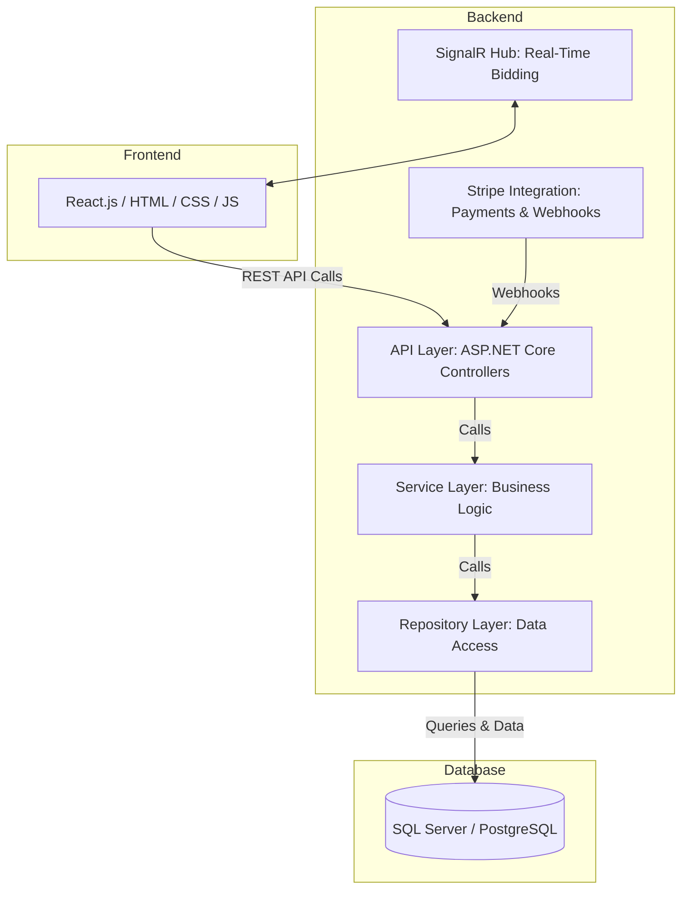

# Auction House System Architecture

---

- **Presentation Layer:** Built using React (Vite + Tailwind CSS), this layer handles user interactions and displays real-time data updates.
- **Business Logic Layer:** Implemented in ASP.NET Core, this layer manages application logic through controllers and services.
- **Data Access Layer:** Uses Entity Framework Core and the Repository Pattern to manage data transactions.
- **SignalR Hub:** Real-time bidding and notifications.
- **Stripe Integration:** Payment sessions and webhooks.
- **Database Layer:** SQL Server (or PostgreSQL) for persistent storage.
