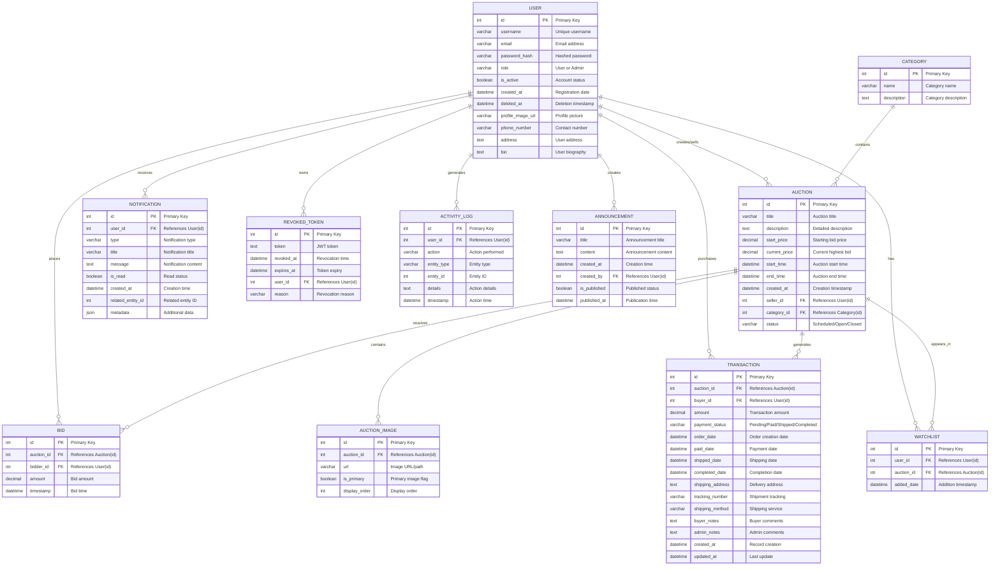

# Auction House Entity-Relationship (ER) Diagram

## ER Diagram (Crow's Foot Notation)

---

## Entity Descriptions

### Core Entities

- **User**: Represents system users (buyers, sellers, admins) with authentication and profile information.
- **Auction**: Represents auction listings with pricing, timing, and status information.
- **Bid**: Records bidding activity on auctions.
- **Transaction**: Manages payment and shipping for completed auctions.
- **Category**: Organizes auctions into categories.

### Supporting Entities

- **Notification**: Real-time notifications for users about bids, auctions, and transactions.
- **AuctionImage**: Stores images for auction listings.
- **RevokedToken**: Tracks invalidated JWT tokens for security.
- **Watchlist**: Allows users to save auctions they're interested in.
- **ActivityLog**: Tracks user actions for audit and analytics.
- **Announcement**: System-wide announcements created by admins.

### Relationships Summary

- User ⟷ Auction: 1-to-many (as Seller)
- User ⟷ Bid: 1-to-many (as Bidder)
- User ⟷ Transaction: 1-to-many (as Buyer)
- User ⟷ Notification: 1-to-many
- User ⟷ RevokedToken: 1-to-many
- User ⟷ Watchlist: 1-to-many
- User ⟷ ActivityLog: 1-to-many
- User ⟷ Announcement: 1-to-many (as Creator)
- Auction ⟷ Category: many-to-1
- Auction ⟷ Bid: 1-to-many
- Auction ⟷ AuctionImage: 1-to-many
- Auction ⟷ Transaction: 1-to-many
- Auction ⟷ Watchlist: 1-to-many

---

**Key Points:**
- **PK** = Primary Key
- **FK** = Foreign Key
- Cardinality: `||` = one, `o{` = many
- PaymentStatus enum: Pending, Paid, Shipped, Completed, Cancelled
- NotificationType enum: Various notification types for different events

This comprehensive ER diagram shows all entities, attributes, and relationships in the Auction House database.
