# Auction House Use Case Diagram

## System Use Cases

```mermaid
graph TB
    subgraph "Auction House System"
        subgraph "Authentication & Profile"
            UC1[Register Account]
            UC2[Login/Logout]
            UC3[Update Profile]
        end
        
        subgraph "Auction Management"
            UC4[Create Auction]
            UC5[View Auctions]
            UC6[Update/Delete Auction]
            UC7[Upload Images]
            UC8[Close Auction]
        end
        
        subgraph "Bidding & Watchlist"
            UC9[Place Bid]
            UC10[View Bid History]
            UC11[Manage Watchlist]
        end
        
        subgraph "Transactions"
            UC12[Process Payment]
            UC13[View Orders]
            UC14[Update Order Status]
        end
        
        subgraph "Notifications"
            UC15[Receive Notifications]
            UC16[View Notifications]
        end
        
        subgraph "Admin Functions"
            UC17[Manage Categories]
            UC18[Manage Users]
            UC19[View Activity Logs]
            UC20[Manage Announcements]
            UC21[View Analytics]
        end
    end
    
    Guest[Guest]
    User[User]
    Admin[Administrator]
    External[External Systems]
    
    Guest -->|performs| UC1
    Guest -->|performs| UC2
    Guest -->|performs| UC5
    
    User -->|performs| UC2
    User -->|performs| UC3
    User -->|performs| UC4
    User -->|performs| UC5
    User -->|performs| UC6
    User -->|performs| UC7
    User -->|performs| UC8
    User -->|performs| UC9
    User -->|performs| UC10
    User -->|performs| UC11
    User -->|performs| UC12
    User -->|performs| UC13
    User -->|performs| UC14
    User -->|performs| UC15
    User -->|performs| UC16
    
    Admin -->|performs| UC2
    Admin -->|performs| UC3
    Admin -->|performs| UC5
    Admin -->|performs| UC6
    Admin -->|performs| UC8
    Admin -->|performs| UC10
    Admin -->|performs| UC13
    Admin -->|performs| UC14
    Admin -->|performs| UC15
    Admin -->|performs| UC16
    Admin -->|performs| UC17
    Admin -->|performs| UC18
    Admin -->|performs| UC19
    Admin -->|performs| UC20
    Admin -->|performs| UC21
    
    UC12 -.->|integrates| External
    UC15 -.->|integrates| External
    
    style Guest fill:#e1f5ff
    style User fill:#c8e6c9
    style Admin fill:#ffccbc
    style External fill:#f3e5f5
```

---

## Actor Descriptions

1. **Guest**
   - Unregistered visitors to the platform
   - Can browse auctions and view public information
   - Must register to participate in bidding

2. **User**
   - Registered users (buyers and sellers)
   - Can create auctions, place bids, make payments
   - Manages their profile and transactions

3. **Administrator**
   - System administrators with full access
   - Manages users, categories, and system content
   - Monitors activity and generates reports

4. **External Systems**
   - Stripe Payment Gateway for payment processing
   - SignalR for real-time notifications
   - Cloud storage for image uploads

---

## Use Case Descriptions

### Authentication & Profile

| Use Case | Description | Actors |
|----------|-------------|--------|
| Register Account | Create a new user account | Guest |
| Login/Logout | Authenticate and manage sessions | Guest, User, Admin |
| Update Profile | Modify profile information and settings | User, Admin |

### Auction Management

| Use Case | Description | Actors |
|----------|-------------|--------|
| Create Auction | List a new item for auction | User |
| View Auctions | Browse and search auctions | Guest, User, Admin |
| Update/Delete Auction | Modify or remove auction listings | User, Admin |
| Upload Images | Add images to auction listing | User |
| Close Auction | End auction and determine winner | User, Admin |

### Bidding & Watchlist

| Use Case | Description | Actors |
|----------|-------------|--------|
| Place Bid | Submit a bid on an active auction | User |
| View Bid History | See all bids placed on an auction | User, Admin |
| Manage Watchlist | Add/remove auctions from watchlist | User |

### Transactions

| Use Case | Description | Actors |
|----------|-------------|--------|
| Process Payment | Complete payment for won auction | User |
| View Orders | See transaction and shipping details | User, Admin |
| Update Order Status | Change payment/shipping status | User, Admin |

### Notifications

| Use Case | Description | Actors |
|----------|-------------|--------|
| Receive Notifications | Get real-time alerts for events | User, Admin |
| View Notifications | See all notifications and mark as read | User, Admin |

### Admin Functions

| Use Case | Description | Actors |
|----------|-------------|--------|
| Manage Categories | Create, update, delete categories | Admin |
| Manage Users | View and manage user accounts | Admin |
| View Activity Logs | Monitor user actions and events | Admin |
| Manage Announcements | Create and publish announcements | Admin |
| View Analytics | Access dashboard and reports | Admin |

---

## System Interactions

- **External Systems** integrate with:
  - **Process Payment**: Stripe handles payment processing
  - **Receive Notifications**: SignalR provides real-time updates

---

This simplified use case diagram shows the core functionality of the Auction House system with clear actor roles and streamlined use cases.
